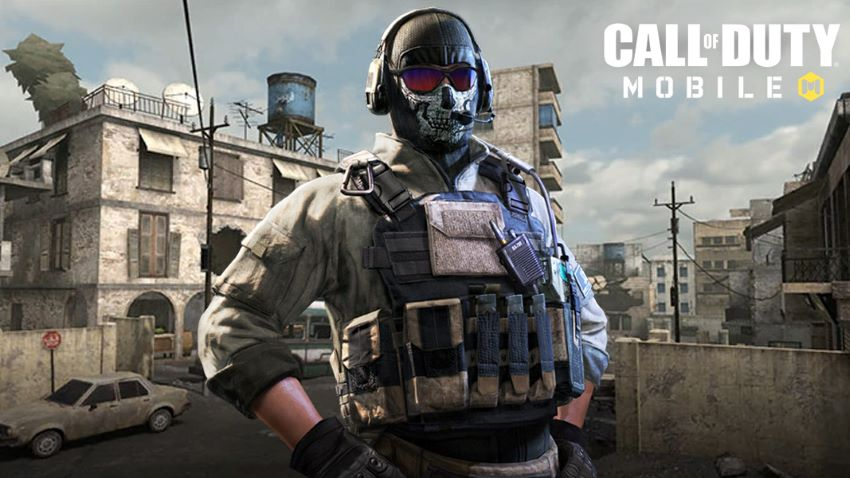
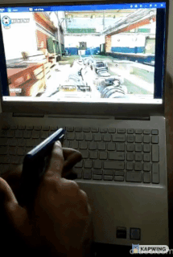
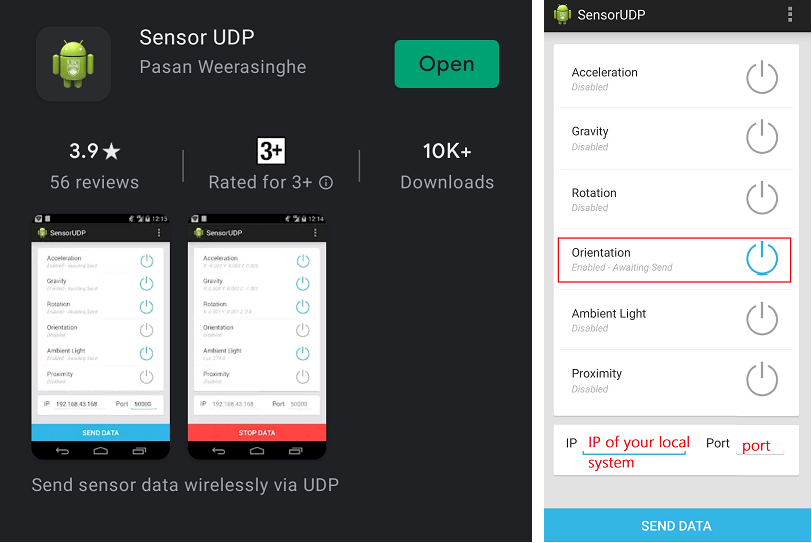
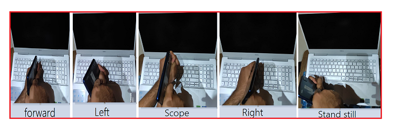

# Call-of-Duty

    



[Demo link](https://www.linkedin.com/feed/update/urn:li:activity:6779814634418401280/)

## Installations 

PyAutoGUI is a cross-platform GUI automation Python module for human beings. Used to programmatically control the mouse & keyboard.

```
pip install PyAutoGUI
```

```
pip install numpy
```

```
pip install SpeechRecognition
```



Download Bluestacks -> [link](https://www.bluestacks.com/)

After downloading Bluestacks open it and go to discover apps and search for Call of Duty and install it.


## Collecting data and building the model

We use the Sensor UDP app , that sends the selected sensor values to a receiving program using UDP. We use the orientation parameters.
After selecting Orientaion and filling the values, tap on send data.



Getting your ip - 

Type in CMD `ipconfig` and get you IP. Now we need trainig data for 5 positions or movements. So we will store the training data in `orientations.csv`
For each orientation, that is run the program `data_collector.py` 5 times for each move and be in that position for around `2 minutes`.

Enter your IP and port number for UDP data transmission in `data_collector.py`.




## Training the SVM model

I have used Support Vector machine as it was giving good accuracy compared to others.

## Gameplay Settings

Start the game and go to settings > Controls and select `Simple Mode`.
Now start your Game and execute the `demo.py` file and enjoy!!

Open to PR's
